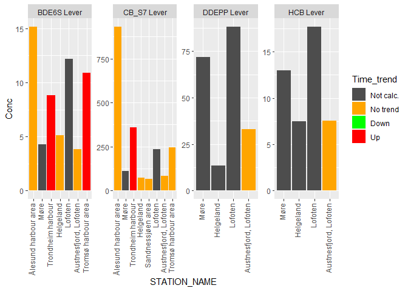

## Packages + functions  

```r
library(dplyr)
```

```
## 
## Attaching package: 'dplyr'
```

```
## The following objects are masked from 'package:stats':
## 
##     filter, lag
```

```
## The following objects are masked from 'package:base':
## 
##     intersect, setdiff, setequal, union
```

```r
library(tidyr)
library(readxl)
library(ggplot2)


# File name for export
fn <- "Data_export/GaduMor_2018_withNIFES_ver4.csv"
overwrite <- FALSE
```

## Data
Indicators from NIVA serves as the starting point for combining the data  

```r
# NIVA medians
data_xl_sel <- readRDS("Data/03_data_xl_sel.rds")

# NIVA indicators
df_indicator <- readRDS("Data/03_df_indicator_NIVA_only.rds") %>%
  filter(!STATION_CODE %in% "19B")                                     # exclude 19B (Svalbard)

# NIFES medians
df_median <- readRDS("Data/01_df_median.rds") %>%
  as.data.frame()

# NIFES regression
nifes_regression <- readRDS("Data/02_nifes_regression.rds")

# Food and EQS limits
df_limits <- read_excel("Input_data/Grenseverdier_fra_Sylvia.xlsx")

# Parameters
sel_param <- c("CD", "HG", "PB", "BDE6S", "HCB", "DDEPP", "CB_S7")
```


## Make 'df_nifes_finalyear'   

```r
df_median <- df_median %>%
  mutate(TISSUE_NAME =
           case_when(Organ %in% "Filet" ~ "Muskel",
                     Organ %in% "Lever" ~ "Lever")
  )

df_median <- df_median %>%
  mutate(STATION_NAME = 
           case_when(Uttaksområde %in% "Møre" ~ "Møre",
                     Uttaksområde %in% c("Træna","Vikna") ~ "Helgeland",
                     Uttaksområde %in% "Vestfjorden" ~ "Lofoten"),
         NIVA_CODE = 
           case_when(TISSUE_NAME %in% "Muskel" ~ "MU",
                     TISSUE_NAME %in% "Lever" ~ "LI")
  )

sel <- df_median$Uttaksområde %in% "Møre"; sum(sel)
```

```
## [1] 315
```

```r
df_median$STATION_NAME[sel] <- "Møre"


# Get last year's median
df_nifes_finalyear <- df_median %>% 
  filter(Parameter %in% sel_param & !is.na(Conc)) %>%
  group_by(STATION_NAME, Parameter, TISSUE_NAME, NIVA_CODE)  %>%
  mutate(Maxyear = max(Year)) %>%
  filter(Year == Maxyear) %>%
  select(-LONGITUDE, -LATITUDE) %>%
  as.data.frame()

df_nifes_pos <- df_median %>% 
  filter(Parameter %in% sel_param & !is.na(Conc)) %>%
  group_by(STATION_NAME)  %>%
  summarize(
    LONGITUDE = median(LONGITUDE, na.rm = TRUE),
    LATITUDE = median(LATITUDE, na.rm = TRUE)
  )

df_nifes_finalyear <- 
  df_nifes_finalyear %>% left_join(df_nifes_pos)
```

```
## Joining, by = "STATION_NAME"
```

```r
xtabs(~Parameter + TISSUE_NAME, df_nifes_finalyear)  
```

```
##          TISSUE_NAME
## Parameter Lever Muskel
##     BDE6S     3      0
##     CB_S7     3      0
##     CD        3      3
##     DDEPP     3      0
##     HCB       3      0
##     HG        3      3
##     PB        3      3
```


## Make 'df_indicator_nifes'

```r
df_indicator_nifes <- tibble(
       PROJECT_ID = 9999,
       LATIN_NAME = "Gadus morhua",
       STATION_CODE = "9999", 
       STATION_NAME = df_nifes_finalyear$STATION_NAME,
       LONGITUDE = df_nifes_finalyear$LONGITUDE, 
       LATITUDE = df_nifes_finalyear$LATITUDE,
       PARAM = df_nifes_finalyear$Parameter,
       N = df_nifes_finalyear$N,
       Conc = df_nifes_finalyear$Conc,
       SPECIES_ID = 17,
       TISSUE_NAME = df_nifes_finalyear$TISSUE_NAME,
       NIVA_CODE = df_nifes_finalyear$NIVA_CODE
       )

# Add TISSUE_NAME to nifes_regression (for join below)
nifes_regression <- nifes_regression %>%
  mutate(TISSUE_NAME =
           case_when(Tissue %in% "Filet" ~ "Muskel",
                     Tissue %in% "Lever" ~ "Lever")
  )

# xtabs(~STATION_NAME, nifes_regression)
nrow(df_indicator_nifes)
```

```
## [1] 30
```

```r
df_indicator_nifes <- left_join(df_indicator_nifes, nifes_regression[,c("PARAM", "TISSUE_NAME", "STATION_NAME", "trend")])
```

```
## Joining, by = c("STATION_NAME", "PARAM", "TISSUE_NAME")
```

```r
nrow(df_indicator_nifes)
```

```
## [1] 30
```

```r
# Check
# df_indicator_nifes %>% select(STATION_NAME, LATITUDE, Conc, NIVA_CODE, trend) %>% View()
# df_indicator %>% select(STATION_NAME, LATITUDE, Conc, NIVA_CODE, trend) %>% View()
```

## Combine NIVA and NIFES data

```r
df_indicator2 <- bind_rows(df_indicator, df_indicator_nifes)
df_indicator2 %>% head(2)
```

<div data-pagedtable="false">
  <script data-pagedtable-source type="application/json">
{"columns":[{"label":["PROJECT_ID"],"name":[1],"type":["dbl"],"align":["right"]},{"label":["LATIN_NAME"],"name":[2],"type":["chr"],"align":["left"]},{"label":["STATION_CODE"],"name":[3],"type":["chr"],"align":["left"]},{"label":["STATION_NAME"],"name":[4],"type":["chr"],"align":["left"]},{"label":["LONGITUDE"],"name":[5],"type":["dbl"],"align":["right"]},{"label":["LATITUDE"],"name":[6],"type":["dbl"],"align":["right"]},{"label":["PARAM"],"name":[7],"type":["chr"],"align":["left"]},{"label":["N"],"name":[8],"type":["int"],"align":["right"]},{"label":["Conc"],"name":[9],"type":["dbl"],"align":["right"]},{"label":["SPECIES_ID"],"name":[10],"type":["dbl"],"align":["right"]},{"label":["TISSUE_NAME"],"name":[11],"type":["chr"],"align":["left"]},{"label":["NIVA_CODE"],"name":[12],"type":["chr"],"align":["left"]},{"label":["trend"],"name":[13],"type":["dbl"],"align":["right"]}],"data":[{"1":"3699","2":"Gadus morhua","3":"13B","4":"Kristiansand harbour area","5":"7.988500","6":"58.13283","7":"BDE6S","8":"NA","9":"7.72805","10":"17","11":"Lever","12":"LI","13":"3"},{"1":"3699","2":"Gadus morhua","3":"23B","4":"Bømlo, Outer Selbjørnfjord","5":"5.108565","6":"59.89562","7":"BDE6S","8":"NA","9":"4.07700","10":"17","11":"Lever","12":"LI","13":"3"}],"options":{"columns":{"min":{},"max":[10]},"rows":{"min":[10],"max":[10]},"pages":{}}}
  </script>
</div>

```r
nrow(df_indicator2)  # 111
```

```
## [1] 117
```

```r
# Check liver
# xtabs(~STATION_NAME + PARAM, df_indicator2 %>% filter(TISSUE_NAME == "Lever"))  # 94
```

## Map data

```r
# Check that all stations have positions
sum(is.na(df_indicator2$LATITUDE))
```

```
## [1] 0
```

```r
df_indicator2 %>%
  count(STATION_NAME, LATITUDE,  LONGITUDE) %>%
  arrange(LATITUDE)
```

<div data-pagedtable="false">
  <script data-pagedtable-source type="application/json">
{"columns":[{"label":["STATION_NAME"],"name":[1],"type":["chr"],"align":["left"]},{"label":["LATITUDE"],"name":[2],"type":["dbl"],"align":["right"]},{"label":["LONGITUDE"],"name":[3],"type":["dbl"],"align":["right"]},{"label":["n"],"name":[4],"type":["int"],"align":["right"]}],"data":[{"1":"Skågskjera, Farsund","2":"58.05138","3":"6.746898","4":"6"},{"1":"Kristiansand harbour area","2":"58.13283","3":"7.988500","4":"5"},{"1":"Tjøme, Outer Oslofjord","2":"59.04050","3":"10.435833","4":"7"},{"1":"Stathelle area, Langesundfjord","2":"59.04650","3":"9.702750","4":"3"},{"1":"Kirkøy, Hvaler","2":"59.06482","3":"10.973540","4":"4"},{"1":"Inner Oslofjord","2":"59.81265","3":"10.551829","4":"7"},{"1":"Bømlo, Outer Selbjørnfjord","2":"59.89562","3":"5.108565","4":"7"},{"1":"Inner Sørfjord","2":"60.09727","3":"6.539719","4":"7"},{"1":"Bergen harbour area","2":"60.39664","3":"5.270690","4":"5"},{"1":"Ålesund harbour area","2":"62.46778","3":"6.068617","4":"5"},{"1":"Møre","2":"62.88917","3":"6.450000","4":"10"},{"1":"Trondheim harbour","2":"63.44562","3":"10.371726","4":"5"},{"1":"Helgeland","2":"65.11000","3":"11.045000","4":"10"},{"1":"Sandnessjøen area","2":"66.04437","3":"12.503554","4":"4"},{"1":"Lofoten","2":"67.82000","3":"14.125000","4":"10"},{"1":"Austnesfjord, Lofoten","2":"68.18577","3":"14.708138","4":"7"},{"1":"Tromsø harbour area","2":"69.65300","3":"18.974000","4":"5"},{"1":"Kjøfjord, Outer Varangerfjord","2":"69.81623","3":"29.760200","4":"6"},{"1":"Hammerfest harbour area","2":"70.65000","3":"23.633333","4":"4"}],"options":{"columns":{"min":{},"max":[10]},"rows":{"min":[10],"max":[10]},"pages":{}}}
  </script>
</div>

```r
plot(LATITUDE ~ LONGITUDE, df_indicator2)
maps::map(regions = "Norway", add = TRUE, col = "brown")
```

<!-- -->

## Filter df_indicator2 by position

```r
df_indicator2 <- df_indicator2 %>% 
  filter(LATITUDE > 62 & LONGITUDE < 22.2)

tab <- df_indicator2 %>%
  count(STATION_NAME, LATITUDE,  LONGITUDE) %>%
  arrange(LATITUDE) 

# Make STATION_NAME a factor with order = latitude
df_indicator2 <- df_indicator2 %>% 
  mutate(STATION_NAME = factor(STATION_NAME, levels = tab$STATION_NAME))

tab 
```

<div data-pagedtable="false">
  <script data-pagedtable-source type="application/json">
{"columns":[{"label":["STATION_NAME"],"name":[1],"type":["chr"],"align":["left"]},{"label":["LATITUDE"],"name":[2],"type":["dbl"],"align":["right"]},{"label":["LONGITUDE"],"name":[3],"type":["dbl"],"align":["right"]},{"label":["n"],"name":[4],"type":["int"],"align":["right"]}],"data":[{"1":"Ålesund harbour area","2":"62.46778","3":"6.068617","4":"5"},{"1":"Møre","2":"62.88917","3":"6.450000","4":"10"},{"1":"Trondheim harbour","2":"63.44562","3":"10.371726","4":"5"},{"1":"Helgeland","2":"65.11000","3":"11.045000","4":"10"},{"1":"Sandnessjøen area","2":"66.04437","3":"12.503554","4":"4"},{"1":"Lofoten","2":"67.82000","3":"14.125000","4":"10"},{"1":"Austnesfjord, Lofoten","2":"68.18577","3":"14.708138","4":"7"},{"1":"Tromsø harbour area","2":"69.65300","3":"18.974000","4":"5"}],"options":{"columns":{"min":{},"max":[10]},"rows":{"min":[10],"max":[10]},"pages":{}}}
  </script>
</div>

## Proref, EQS and mattrygghet

```r
# Get PROREF (Q95) and EQS
df_q95 <- data_xl_sel[data_xl_sel$Basis %in% "WW", c("PARAM", "LATIN_NAME", "TISSUE_NAME", "Q95", "EQS")] %>%
  group_by(PARAM, LATIN_NAME, TISSUE_NAME) %>%
  summarise(Q95 = first(Q95), EQS_threshold = first(EQS))

# Check
# df_q95 %>% filter(PARAM == "HG")

# add PROREF and EQS thresholds
nrow(df_indicator2) # 94
```

```
## [1] 56
```

```r
df_indicator2 <- left_join(df_indicator2, df_q95)
```

```
## Joining, by = c("LATIN_NAME", "PARAM", "TISSUE_NAME")
```

```r
nrow(df_indicator2) # 94
```

```
## [1] 56
```

```r
# change EQS threshold for Hg (by mail from Norman; from 1.00 to 0.67)
sel <- df_indicator2$PARAM %in% "CB_S7"; sum(sel) 
```

```
## [1] 8
```

```r
df_indicator2$EQS_threshold[sel] <- 0.67

# Classes changed - original classes were: c(-999999,1,2,5,10,20,999999)
df_indicator2$KLASSE <- with(df_indicator2, 
                             cut(Conc/Q95, breaks = c(-999999,1,2,10,999999), 
                                 right = FALSE, labels = FALSE)
                             )

xtabs(~KLASSE + PARAM, df_indicator2)
```

```
##       PARAM
## KLASSE BDE6S CB_S7 CD DDEPP HCB HG PB
##      1     7     7  8     4   3  3  8
##      2     0     1  0     0   1  1  0
##      3     0     0  0     0   0  4  0
```

```r
#       PARAM
# KLASSE BDE6S CB_S7 CD DDEPP HCB HG PB
#      1     7     7  8     1   1  3  8
#      2     0     1  0     0   0  1  0
#      3     0     0  0     0   0  4  0
     

# EQS classe
df_indicator2$EQS <- with(df_indicator2, 
                          cut(Conc/EQS_threshold, breaks = c(-999999,1,999999), 
                              right = FALSE, labels = FALSE)
                          )

xtabs(~addNA(EQS) + PARAM, df_indicator2)
```

```
##           PARAM
## addNA(EQS) BDE6S CB_S7 CD DDEPP HCB HG PB
##       1        0     0  0     4   2  0  0
##       2        7     8  0     0   2  8  0
##       <NA>     0     0 11     0   0  3 11
```

```r
#           PARAM
# addNA(EQS) BDE6S CB_S7 CD DDEPP HCB HG PB
#       1        0     0  0     1   1  0  0
#       2        7     8  0     0   0  8  0
#       <NA>     0     0 11     0   0  3 11
```

## Add SPECIES_ID

```r
species_code <- 17
df_indicator2$SPECIES_ID <- species_code
```

## Add food limit  
1 = below limit, 2 = above limit

```r
nrow(df_indicator2)
```

```
## [1] 56
```

```r
df_indicator2 <- left_join(
  df_indicator2, 
  subset(df_limits, select = c(PARAM, LATIN_NAME, NIVA_CODE, Mattrygghet)), 
  by = c("PARAM", "LATIN_NAME", "NIVA_CODE"))
nrow(df_indicator2)
```

```
## [1] 56
```

```r
# 96

df_indicator2$Mattrygghet <- cut(with(df_indicator2, Conc/Mattrygghet),
                                 breaks = c(-999999,1,999999), 
                                 right = FALSE, labels = FALSE)

xtabs(~addNA(Mattrygghet) + PARAM + TISSUE_NAME, df_indicator2)
```

```
## , , TISSUE_NAME = Lever
## 
##                   PARAM
## addNA(Mattrygghet) BDE6S CB_S7 CD DDEPP HCB HG PB
##               1        0     4  0     0   0  0  0
##               2        0     4  0     0   0  0  0
##               <NA>     7     0  8     4   4  3  8
## 
## , , TISSUE_NAME = Muskel
## 
##                   PARAM
## addNA(Mattrygghet) BDE6S CB_S7 CD DDEPP HCB HG PB
##               1        0     0  3     0   0  8  3
##               2        0     0  0     0   0  0  0
##               <NA>     0     0  0     0   0  0  0
```

```r
# tail(df_indicator2)
```

## Save and export  
* On 'data': save with all variables   
* On 'Data_export': pick selected variables  

```r
# Save with all variables
saveRDS(df_indicator2, file = "Data/04_df_indicator2_cod_ver4.RData")

# Save with selected variables
vars <- c("PROJECT_ID", "STATION_CODE", "STATION_NAME", 
  "LONGITUDE", "LATITUDE", "PARAM", "N", "KLASSE", 
  "SPECIES_ID", "trend", "NIVA_CODE", "EQS", "Mattrygghet")

# DOnt include HG in liver
sel <- with(df_indicator2, !(PARAM == "HG" & TISSUE_NAME == "Lever"))

# setwd("H:/Documents/seksjon 212/Indikator 2018/Analyse")

#
# E
if (overwrite | !file.exists(fn)){
  write.csv2(df_indicator2[sel,vars], file = fn, row.names = FALSE, na = "")
  cat("Data written to file", fn, "\n")
} else {
  cat("File", fn, "exists, data not saved.\nSet 'overwrite <- TRUE' to overwrite file.\n")
}
```

```
## File Data_export/GaduMor_2018_withNIFES_ver4.csv exists, data not saved.
## Set 'overwrite <- TRUE' to overwrite file.
```

```r
# df_indicator2 <- read.csv2(file = "Data_export/GaduMor_2018_withNIFES_ver1.csv")
```

## Checks
### Plots, metals
trend: 0 = no trend calculated, 1 = zero time trend, 2 = up, 3 = down  

```r
df <- df_indicator2 %>%
  filter(!(PARAM == "HG" & TISSUE_NAME == "Lever")) %>%
  mutate(Time_trend =
           case_when(trend %in% 0 ~ "Not calc.",
                     trend %in% 1 ~ "No trend",
                     trend %in% 2 ~ "Down",
                     trend %in% 3 ~ "Up")
         ) %>%
  mutate(Time_trend = factor(Time_trend, levels = c("Not calc.", "No trend", "Down", "Up")),
         Mattrygghet = factor(Mattrygghet, levels = 1:2),
         EQS = factor(EQS, levels = 1:2))

# Fill = trend
gg1 <- df %>%
  filter(PARAM %in% c("HG", "PB", "CD")) %>%
  ggplot(aes(STATION_NAME, Conc, fill = Time_trend)) + 
  geom_col() + 
  scale_fill_manual(values = c("grey30", "orange", "green", "red"), drop = FALSE) +
  facet_wrap(~paste(PARAM,TISSUE_NAME), scales = "free", nrow = 1) +
  theme(axis.text.x = element_text(angle = 90, hjust = 1, vjust = 0.2))

# Fill = Mattrygghet
gg2 <- df %>%
  filter(PARAM %in% c("HG", "PB", "CD")) %>%
  ggplot(aes(STATION_NAME, Conc, fill = Mattrygghet)) + 
  geom_col() + 
  scale_fill_manual(values = c("green", "red"), na.value = "grey30", drop = FALSE) +
  facet_wrap(~paste(PARAM,TISSUE_NAME), scales = "free", nrow = 1) +
  theme(axis.text.x = element_text(angle = 90, hjust = 1, vjust = 0.2))

# Fill = EQS
gg3 <- df %>%
  filter(PARAM %in% c("HG", "PB", "CD")) %>%
  ggplot(aes(STATION_NAME, Conc, fill = EQS)) + 
  geom_col() + 
  scale_fill_manual(values = c("green", "red"), na.value = "grey30", drop = FALSE) +
  facet_wrap(~paste(PARAM,TISSUE_NAME), scales = "free", nrow = 1) +
  theme(axis.text.x = element_text(angle = 90, hjust = 1, vjust = 0.2))

# ggsave()

gg1
```

<!-- -->

```r
gg2
```

<!-- -->

```r
gg3
```

<!-- -->

### Plots, non-metals

```r
gg4 <- df %>%
  filter(!PARAM %in% c("HG", "PB", "CD")) %>%
  ggplot(aes(STATION_NAME, Conc, fill = Time_trend)) + 
  geom_bar(stat = "identity") + 
  scale_fill_manual(values = c("grey30", "orange", "green", "red"), drop = FALSE) +
  facet_wrap(~paste(PARAM,TISSUE_NAME), scales = "free", nrow = 1) +
  theme(axis.text.x = element_text(angle = 90, hjust = 1, vjust = 0.2))


# Fill = Mattrygghet
gg5 <- df %>%
  filter(!PARAM %in% c("HG", "PB", "CD")) %>%
  ggplot(aes(STATION_NAME, Conc, fill = Mattrygghet)) + 
  geom_col() + 
  scale_fill_manual(values = c("green", "red"), na.value = "grey30", drop = FALSE) +
  facet_wrap(~paste(PARAM,TISSUE_NAME), scales = "free", nrow = 1) +
  theme(axis.text.x = element_text(angle = 90, hjust = 1, vjust = 0.2))

# Fill = EQS
gg6 <- df %>%
  filter(!PARAM %in% c("HG", "PB", "CD")) %>%
  ggplot(aes(STATION_NAME, Conc, fill = EQS)) + 
  geom_col() + 
  scale_fill_manual(values = c("green", "red"), na.value = "grey30", drop = FALSE) +
  facet_wrap(~paste(PARAM,TISSUE_NAME), scales = "free", nrow = 1) +
  theme(axis.text.x = element_text(angle = 90, hjust = 1, vjust = 0.2))

gg4
```

<!-- -->

```r
gg5
```

<!-- -->

```r
gg6
```

<!-- -->
