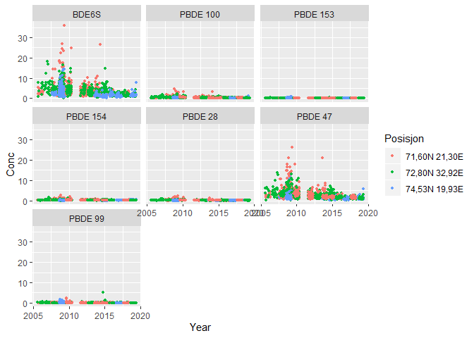

Based on code from '01_NIVA_data_with_NIFES_3.R' ("H:/Documents/seksjon 212/Indikator 2018/Analyse")  

## 1. Packages  


## 2. Data  

```r
dir("Input_data")
```

```
## [1] "_README.txt"                              
## [2] "Cd Pb torsk lever 2006-2019 HI.xlsx"      
## [3] "Data kysttorsk NH nov. 2018.xlsx"         
## [4] "Grenseverdier_fra_Sylvia.xlsx"            
## [5] "Kvikksølv torskefilet Bhav 2006-2019.xlsx"
## [6] "POPs torskelever Bhav 2006-2019.xlsx"
```

```r
fn <- "Input_data/Cd Pb torsk lever 2006-2019 HI.xlsx"
# excel_sheets(fn)
dat1 <- read_excel(fn, col_types = "text")

fn <- "Input_data/Kvikksølv torskefilet Bhav 2006-2019.xlsx"
# excel_sheets(fn)
dat2 <- read_excel(fn, col_types = "text") %>%
  rename(Prøvenr. = `Prøve nr.`)      # fix this column name (equal to dat1)

fn <- "Input_data/POPs torskelever Bhav 2006-2019.xlsx"
# excel_sheets(fn)
dat3 <- read_excel(fn, col_types = "text") %>%
  rename(Prøvenr. = `Prøve nr.`)      # fix this column name (equal to dat1)
```

### Check column names

```r
data.frame(
  n1 = colnames(dat1)[1:10],
  n2 = colnames(dat2)[1:10],
  n3 = colnames(dat3)[1:10]
)
```

<div data-pagedtable="false">
  <script data-pagedtable-source type="application/json">
{"columns":[{"label":["n1"],"name":[1],"type":["fctr"],"align":["left"]},{"label":["n2"],"name":[2],"type":["fctr"],"align":["left"]},{"label":["n3"],"name":[3],"type":["fctr"],"align":["left"]}],"data":[{"1":"Jnr","2":"Jnr","3":"Jnr"},{"1":"Prøvenr.","2":"Prøvenr.","3":"Prøvenr."},{"1":"År","2":"År","3":"År"},{"1":"Område","2":"Område","3":"Område"},{"1":"Posisjon","2":"Posisjon","3":"Posisjon"},{"1":"Art","2":"Art","3":"Art"},{"1":"Organ","2":"Organ","3":"Organ"},{"1":"Engelsk beskrivelse","2":"Engelsk beskrivelse","3":"Engelsk beskrivelse"},{"1":"Latinsk navn","2":"Latinsk navn","3":"Latinsk navn"},{"1":"Produkt beskrivelse","2":"Produkt beskrivelse","3":"Produkt beskrivelse"}],"options":{"columns":{"min":{},"max":[10]},"rows":{"min":[10],"max":[10]},"pages":{}}}
  </script>
</div>

```r
data.frame(
  n1 = colnames(dat1)[11:14],
  n2 = colnames(dat2)[11:14],
  n3 = colnames(dat3)[11:14]
)
```

<div data-pagedtable="false">
  <script data-pagedtable-source type="application/json">
{"columns":[{"label":["n1"],"name":[1],"type":["fctr"],"align":["left"]},{"label":["n2"],"name":[2],"type":["fctr"],"align":["left"]},{"label":["n3"],"name":[3],"type":["fctr"],"align":["left"]}],"data":[{"1":"Cd","2":"Hg","3":"PCB-101"},{"1":"Enhet","2":"Enhet","3":"Enhet"},{"1":"Pb","2":"X__1","3":"PCB-118"},{"1":"Enhet__1","2":"NA","3":"Enhet__1"}],"options":{"columns":{"min":{},"max":[10]},"rows":{"min":[10],"max":[10]},"pages":{}}}
  </script>
</div>

```r
# cat("\n")
# colnames(dat2)
```


### Check sample identifiers   

```r
# All should be zero - not the case for dat2 (16)
for (dat in list(dat1, dat2, dat3))
  print(
    dat %>%
      count(Jnr, Prøvenr.) %>%
      filter(n > 1) %>% nrow()
  )
```

```
## [1] 0
## [1] 16
## [1] 0
```

```r
# Prøvenr. lacking for all in dat2:
dat2 %>%
  count(Jnr, Prøvenr.) %>%
  filter(n > 1)
```

<div data-pagedtable="false">
  <script data-pagedtable-source type="application/json">
{"columns":[{"label":["Jnr"],"name":[1],"type":["chr"],"align":["left"]},{"label":["Prøvenr."],"name":[2],"type":["chr"],"align":["left"]},{"label":["n"],"name":[3],"type":["int"],"align":["right"]}],"data":[{"1":"2006-245","2":"NA","3":"25"},{"1":"2006-434","2":"NA","3":"25"},{"1":"2006-442","2":"NA","3":"25"},{"1":"2007-1199","2":"NA","3":"25"},{"1":"2007-481","2":"NA","3":"25"},{"1":"2007-545","2":"NA","3":"8"},{"1":"2007-546","2":"NA","3":"9"},{"1":"2007-547","2":"NA","3":"9"},{"1":"2007-566","2":"NA","3":"10"},{"1":"2007-567","2":"NA","3":"13"},{"1":"2008-372","2":"NA","3":"25"},{"1":"2008-374","2":"NA","3":"25"},{"1":"2008-375","2":"NA","3":"25"},{"1":"2008-520","2":"NA","3":"25"},{"1":"2009-749","2":"NA","3":"24"},{"1":"2009-750","2":"NA","3":"3"}],"options":{"columns":{"min":{},"max":[10]},"rows":{"min":[10],"max":[10]},"pages":{}}}
  </script>
</div>

```r
# Set prøvenr. for dat2:
dat2 <- dat2 %>%
  group_by(Jnr) %>%
  mutate(Prøvenr. = 1:length(Jnr) %>% as.character())

# If we now run the stuff on top again, it's OK (zero for all 3)
```

## 3. Standardize and combine data
  
Put all data sets on long format and combine

```r
df_nifes_cod <- bind_rows(
  nifes_standardize_data(dat1),
  nifes_standardize_data(dat2),
  nifes_standardize_data(dat3)
)
```

```
## Warning in function_list[[k]](value): NAs introduced by coercion
```

## 4. Missing values  

### Check missing values  

```r
# 1. Missing Conc values (list of parameters)
tab <- xtabs(~Parameter + is.na(Conc), df_nifes_cod)
tab[tab[,2] > 0,]
```

```
##                          is.na(Conc)
## Parameter                 FALSE TRUE
##   Hexachlorobenzene (HCB)   586 1035
##   op-DDD                    534 1087
##   op-DDE                    534 1087
##   op-DDT                    552 1069
##   PCB-101                  1612    9
##   PCB-118                  1612    9
##   PCB-138                  1612    9
##   PCB-153                  1612    9
##   PCB-180                  1612    9
##   PCB-28                   1612    9
##   PCB-52                   1612    9
##   pp-DDD                    552 1069
##   pp-DDE                    552 1069
##   pp-DDT                    552 1069
##   Sum PCB 6                1612    9
##   Sum PCB 7                1612    9
```

```r
cat(sum(tab[,2]), "missing Conc values\n")
```

```
## 7566 missing Conc values
```

```r
sel1 <- is.na(df_nifes_cod$Conc) & !is.na(df_nifes_cod$Conc_chr) 
cat(sum(sel1), "missing Conc values with non-missing values of Conc_chr\n")
```

```
## 14 missing Conc values with non-missing values of Conc_chr
```

```r
sel2 <- df_nifes_cod$Comment != ""
cat(sum(sel2), "'starred' Conc_chr values\n")
```

```
## 4 'starred' Conc_chr values
```

```r
# 2. Missing Conc but unmissing Conc_chr values
# All have "n.a."
df_nifes_cod[sel1,] %>% select(Jnr, Parameter, Conc_chr, Conc, Unit, Flag)
```

<div data-pagedtable="false">
  <script data-pagedtable-source type="application/json">
{"columns":[{"label":["Jnr"],"name":[1],"type":["chr"],"align":["left"]},{"label":["Parameter"],"name":[2],"type":["chr"],"align":["left"]},{"label":["Conc_chr"],"name":[3],"type":["chr"],"align":["left"]},{"label":["Conc"],"name":[4],"type":["dbl"],"align":["right"]},{"label":["Unit"],"name":[5],"type":["chr"],"align":["left"]},{"label":["Flag"],"name":[6],"type":["chr"],"align":["left"]}],"data":[{"1":"2009-769","2":"Hexachlorobenzene (HCB)","3":"n.a","4":"NA","5":"ng/g ww","6":""},{"1":"2009-769","2":"op-DDD","3":"n.a","4":"NA","5":"ng/g","6":""},{"1":"2009-769","2":"op-DDE","3":"n.a","4":"NA","5":"ng/g","6":""},{"1":"2009-769","2":"op-DDT","3":"n.a","4":"NA","5":"ng/g","6":""},{"1":"2009-769","2":"pp-DDD","3":"n.a","4":"NA","5":"ng/g","6":""},{"1":"2009-769","2":"pp-DDE","3":"n.a","4":"NA","5":"ng/g","6":""},{"1":"2009-769","2":"pp-DDT","3":"n.a","4":"NA","5":"ng/g","6":""},{"1":"2009-770","2":"Hexachlorobenzene (HCB)","3":"n.a","4":"NA","5":"ng/g ww","6":""},{"1":"2009-770","2":"op-DDD","3":"n.a","4":"NA","5":"ng/g","6":""},{"1":"2009-770","2":"op-DDE","3":"n.a","4":"NA","5":"ng/g","6":""},{"1":"2009-770","2":"op-DDT","3":"n.a","4":"NA","5":"ng/g","6":""},{"1":"2009-770","2":"pp-DDD","3":"n.a","4":"NA","5":"ng/g","6":""},{"1":"2009-770","2":"pp-DDE","3":"n.a","4":"NA","5":"ng/g","6":""},{"1":"2009-770","2":"pp-DDT","3":"n.a","4":"NA","5":"ng/g","6":""}],"options":{"columns":{"min":{},"max":[10]},"rows":{"min":[10],"max":[10]},"pages":{}}}
  </script>
</div>

```r
# 3. Starred values
df_nifes_cod[sel2,] %>% select(Jnr, Parameter, Conc_chr, Conc, Unit, Flag, Comment)
```

<div data-pagedtable="false">
  <script data-pagedtable-source type="application/json">
{"columns":[{"label":["Jnr"],"name":[1],"type":["chr"],"align":["left"]},{"label":["Parameter"],"name":[2],"type":["chr"],"align":["left"]},{"label":["Conc_chr"],"name":[3],"type":["chr"],"align":["left"]},{"label":["Conc"],"name":[4],"type":["dbl"],"align":["right"]},{"label":["Unit"],"name":[5],"type":["chr"],"align":["left"]},{"label":["Flag"],"name":[6],"type":["chr"],"align":["left"]},{"label":["Comment"],"name":[7],"type":["chr"],"align":["left"]}],"data":[{"1":"2009-769","2":"pp-DDE","3":"134*","4":"134","5":"ng/g","6":"","7":"*"},{"1":"2009-769","2":"pp-DDE","3":"132*","4":"132","5":"ng/g","6":"","7":"*"},{"1":"2009-770","2":"pp-DDE","3":"189*","4":"189","5":"ng/g","6":"","7":"*"},{"1":"2009-770","2":"pp-DDE","3":"127*","4":"127","5":"ng/g","6":"","7":"*"}],"options":{"columns":{"min":{},"max":[10]},"rows":{"min":[10],"max":[10]},"pages":{}}}
  </script>
</div>

### Remove missing values  

```r
df_nifes_cod <- df_nifes_cod %>%
  filter(!is.na(Conc))
```


## 5. Add Lat, Long

### Check lacking positions  

```r
# Just three positions, and some (125) missing 
df_nifes_cod %>% 
  count(Posisjon)
```

<div data-pagedtable="false">
  <script data-pagedtable-source type="application/json">
{"columns":[{"label":["Posisjon"],"name":[1],"type":["chr"],"align":["left"]},{"label":["n"],"name":[2],"type":["int"],"align":["right"]}],"data":[{"1":"71,60N 21,30E","2":"8539"},{"1":"72,80N 32,92E","2":"9359"},{"1":"74,53N 19,93E","2":"5848"},{"1":"NA","2":"125"}],"options":{"columns":{"min":{},"max":[10]},"rows":{"min":[10],"max":[10]},"pages":{}}}
  </script>
</div>

```r
# All are Hg in cod fillet
df_nifes_cod %>%
  mutate(Has_position = ifelse(is.na(Posisjon),"Lack_position", "Has_position")) %>%
  count(Art, Organ, Parameter, Has_position) %>%
  pivot_wider(names_from = Has_position, values_from = n) %>%
  filter(!is.na(Lack_position))
```

<div data-pagedtable="false">
  <script data-pagedtable-source type="application/json">
{"columns":[{"label":["Art"],"name":[1],"type":["chr"],"align":["left"]},{"label":["Organ"],"name":[2],"type":["chr"],"align":["left"]},{"label":["Parameter"],"name":[3],"type":["chr"],"align":["left"]},{"label":["Has_position"],"name":[4],"type":["int"],"align":["right"]},{"label":["Lack_position"],"name":[5],"type":["int"],"align":["right"]}],"data":[{"1":"TORSK","2":"Filet","3":"Hg","4":"1928","5":"125"}],"options":{"columns":{"min":{},"max":[10]},"rows":{"min":[10],"max":[10]},"pages":{}}}
  </script>
</div>

```r
# One Lnr may have several positions
#  (So we cant use Jnr for fixing position)
df_nifes_cod %>% 
  filter(!is.na(Posisjon)) %>%
  count(Jnr, Posisjon) %>%
  count(Jnr) %>%
  rename(No_of_positions_per_Jnr = n) %>%
  count(No_of_positions_per_Jnr)
```

<div data-pagedtable="false">
  <script data-pagedtable-source type="application/json">
{"columns":[{"label":["No_of_positions_per_Jnr"],"name":[1],"type":["int"],"align":["right"]},{"label":["n"],"name":[2],"type":["int"],"align":["right"]}],"data":[{"1":"1","2":"25"},{"1":"2","2":"46"},{"1":"3","2":"18"}],"options":{"columns":{"min":{},"max":[10]},"rows":{"min":[10],"max":[10]},"pages":{}}}
  </script>
</div>

### Remove lacking positions  

```r
df_nifes_cod <- df_nifes_cod %>%
  filter(!is.na(Posisjon))
```

### Extract Lat,long

```r
df_nifes_cod <- df_nifes_cod %>%
  # Split spring
  separate(Posisjon, c("LATITUDE","LONGITUDE"), sep = "[:blank:]", remove = FALSE) %>%
  # Remove letters
  mutate(LATITUDE = sub("[a-zA-Z]", "", LATITUDE),
         LONGITUDE = sub("[a-zA-Z]", "", LONGITUDE)) %>%
  # Get LATITUDE, LONGITUDE (first replace decimal comma by '.', then convert)
  mutate(LATITUDE = as.numeric(sub(",", ".", LATITUDE)),
         LONGITUDE = as.numeric(sub(",", ".", LONGITUDE))
  )

df_nifes_cod %>% 
  count(Posisjon, LATITUDE, LONGITUDE)
```

<div data-pagedtable="false">
  <script data-pagedtable-source type="application/json">
{"columns":[{"label":["Posisjon"],"name":[1],"type":["chr"],"align":["left"]},{"label":["LATITUDE"],"name":[2],"type":["dbl"],"align":["right"]},{"label":["LONGITUDE"],"name":[3],"type":["dbl"],"align":["right"]},{"label":["n"],"name":[4],"type":["int"],"align":["right"]}],"data":[{"1":"71,60N 21,30E","2":"71.60","3":"21.30","4":"8539"},{"1":"72,80N 32,92E","2":"72.80","3":"32.92","4":"9359"},{"1":"74,53N 19,93E","2":"74.53","3":"19.93","4":"5848"}],"options":{"columns":{"min":{},"max":[10]},"rows":{"min":[10],"max":[10]},"pages":{}}}
  </script>
</div>

## 6. More fixing     

### Fix year     

Don't have date, so we can't set Measurement year = 1.april to 31. March...    

```r
# df_nifes_cod %>% 
#   count(År)

df_nifes_cod <- df_nifes_cod %>% 
  mutate(Year = as.numeric(År))

df_nifes_cod %>% 
  count(År)
```

<div data-pagedtable="false">
  <script data-pagedtable-source type="application/json">
{"columns":[{"label":["År"],"name":[1],"type":["chr"],"align":["left"]},{"label":["n"],"name":[2],"type":["int"],"align":["right"]}],"data":[{"1":"1994","2":"50"},{"1":"1998","2":"50"},{"1":"2001","2":"100"},{"1":"2002","2":"101"},{"1":"2006","2":"407"},{"1":"2007","2":"456"},{"1":"2008","2":"1426"},{"1":"2009","2":"7765"},{"1":"2010","2":"2107"},{"1":"2012","2":"1763"},{"1":"2013","2":"1772"},{"1":"2014","2":"1706"},{"1":"2015","2":"1787"},{"1":"2016","2":"1628"},{"1":"2017","2":"1528"},{"1":"2018","2":"591"},{"1":"2019","2":"509"}],"options":{"columns":{"min":{},"max":[10]},"rows":{"min":[10],"max":[10]},"pages":{}}}
  </script>
</div>

### Fix tissue  

Both Filet and Muskel, set all to Muskel  


```r
# Both Filet and Muskel, 
# xtabs(~Year + Organ + Art, df_nifes_cod)  

df_nifes_cod <- df_nifes_cod %>% 
  mutate(Organ = ifelse(Organ %in% "Filet", "Muskel", Organ))

xtabs(~Year + Organ + Art, df_nifes_cod)  
```

```
## , , Art = TORSK
## 
##       Organ
## Year   Lever Muskel
##   1994     0     50
##   1998     0     50
##   2001     0    100
##   2002     0    101
##   2006   357     50
##   2007   357     99
##   2008  1326    100
##   2009  7109    656
##   2010  1882    225
##   2012  1644    119
##   2013  1648    124
##   2014  1611     95
##   2015  1690     97
##   2016  1539     89
##   2017  1428    100
##   2018   541     50
##   2019   462     47
```

## 7. Checks

```r
unique(df_nifes_cod$Parameter)
```

```
##  [1] "Cd"                      "Pb"                     
##  [3] "Hg"                      "PCB-101"                
##  [5] "PCB-118"                 "PCB-138"                
##  [7] "PCB-153"                 "PCB-180"                
##  [9] "PCB-28"                  "PCB-52"                 
## [11] "Sum PCB 6"               "Sum PCB 7"              
## [13] "Hexachlorobenzene (HCB)" "op-DDD"                 
## [15] "op-DDE"                  "op-DDT"                 
## [17] "pp-DDD"                  "pp-DDE"                 
## [19] "pp-DDT"
```

```r
# unique(df_nifes_cod$Parameter) %>% dput()
```

### Test plot  
Annual medians of the most important parameters

```r
df_nifes_cod %>%
  filter(Parameter %in% c("Cd", "Pb", "Hg", "PCB-118", "Sum PCB 7", 
                          "Hexachlorobenzene (HCB)", "pp-DDE")) %>%
  group_by(Year, Posisjon, Parameter, Organ) %>%
  mutate(Conc_median = median(Conc)) %>%
  ggplot(aes(Year, Conc_median, color = Posisjon)) +
  geom_smooth(method = "lm") + geom_point() +
  facet_wrap(vars(Parameter, Organ), scales = "free_y")
```

<!-- -->


## 9. Create df_median and set parameter names  
Note that we use Flag = "" for data over LOQ (not ">" as in the original script)  

```r
# Create df_median
df_median <- df_nifes_cod %>% 
  group_by(Year, Posisjon, LONGITUDE, LATITUDE, Art, Organ, Parameter) %>%
  summarise(Conc = median(Conc), 
            Conc_min = min(Conc), Conc_max = max(Conc),
            N = n(), Over_LOQ = sum(Flag %in% "")
            )


# set parameter names
df_median <- df_median %>%
  mutate(Parameter = sub("PCB-", "CB", Parameter, fixed = TRUE)) %>% # xtabs(~Parameter, .)
  mutate(Parameter = case_when(
    Parameter %in% "Cd" ~ "CD",
    Parameter %in% "Pb" ~ "PB",
    Parameter %in% "Hg" ~ "HG",
    Parameter %in% "Sum PCB 7" ~ "CB_S7",
    Parameter %in% "Hexachlorobenzene (HCB)" ~ "HCB",
    Parameter %in% "pp-DDE" ~ "DDEPP",     # the rest of the DDT compounds we ignore
    TRUE ~ Parameter)
    )

unique(df_median$Parameter)
```

```
##  [1] "HG"        "CD"        "PB"        "CB101"     "CB118"     "CB138"    
##  [7] "CB153"     "CB180"     "CB28"      "CB52"      "Sum PCB 6" "CB_S7"    
## [13] "HCB"       "op-DDD"    "op-DDE"    "op-DDT"    "pp-DDD"    "DDEPP"    
## [19] "pp-DDT"
```

```r
# Check all
# cat("Parameters:\n", table(df_median$Parameter) %>% names() %>% paste(collapse = "; "))
```

## 10. Save 

```r
# dir.create("Data")

if (save_data){
  saveRDS(df_nifes_cod, "Data/11_df_nifes_cod (2020).rds")
  saveRDS(df_median, "Data/11_df_median (2020).rds")
}

# df_median <- readRDS("Data/01_df_median.rds")
# xtabs(~Parameter + Organ, df_median)
```


