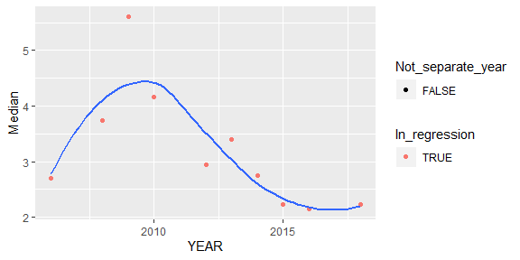
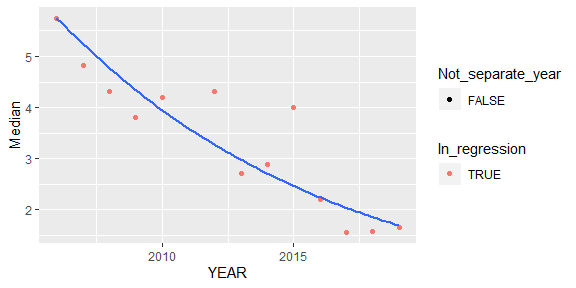
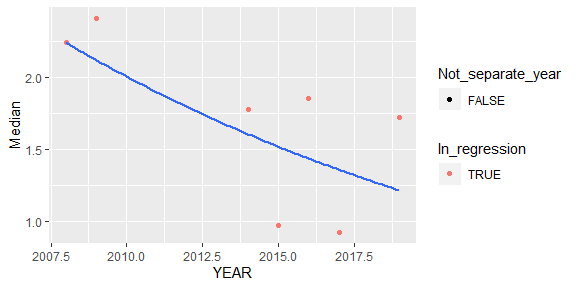

Based on code from '04_NIVA_data_with_NIFES_3.R' ("H:/Documents/seksjon 212/Indikator 2018/Analyse")  


## 1. Packages + functions  

```r
library(dplyr)
library(tidyr)
library(readxl)
library(ggplot2)
library(mgcv)         # for gam()
library(AICcmodavg)   # for AICc()

source("00_functions.R")
source("16_Trend_functions.R")
```

## 2. Data

```r
df_median <- readRDS("Data/11_df_median (2020).rds") %>%
  rename(TISSUE_NAME = Organ) %>%   # avoid a bunch of annoying error messages...
  as.data.frame() 
```

## 3. Functions for performing regression    
From '04_NIVA_data_with_NIFES_3.R', but added 'areas' as input ('Uttaksområde')  

```r
#
# Get regression for one time-series
# Returns a data frame with a sinlge line
#
get_regression_statistics <- function(par, tissue, position){
  df_median_sel <- df_median  %>% 
    filter(Parameter %in% par & Posisjon %in% position & TISSUE_NAME %in% tissue & !is.na(Conc)) %>%
    rename(YEAR = Year, Median = Conc)
  df_med_object <- df_median_sel %>% select_for_regr_a() %>% select_for_regr_b()
  modelresults <- try(calc_models_gam(df_med_object, log = TRUE))
  if (class(modelresults)[[1]] != "try-error"){
    res <- statistics_for_excel(df_med_object, modelresults, gam = TRUE)
  } else {
    res <- statistics_for_excel_empty(df_median_sel)
    res$N <- df_med_object$N
    res$Nplus <- df_med_object$Nplus
  }
  data.frame(Posisjon = position, Parameter = par, TISSUE_NAME = tissue, res, stringsAsFactors = FALSE)
}

#
# Check regression 
# Exactly as get_regression_statistics, except that it also returs the data
#
check_regression_statistics <- function(par, tissue, position){
  df_median_sel <- df_median  %>% 
    filter(Parameter %in% par & Posisjon %in% position & TISSUE_NAME %in% tissue & !is.na(Conc)) %>%
    rename(YEAR = Year, Median = Conc)
  df_med_object <- df_median_sel %>% select_for_regr_a() %>% select_for_regr_b()
  modelresults <- try(calc_models_gam(df_med_object, log = TRUE))
  if (class(modelresults)[[1]] != "try-error"){
    res <- statistics_for_excel(df_med_object, modelresults, gam = TRUE)
  } else {
    res <- statistics_for_excel_empty(df_median_sel)
    res$N <- df_med_object$N
    res$Nplus <- df_med_object$Nplus
  }
  list(
    statistics = data.frame(Posisjon = position, Parameter = par, TISSUE_NAME = tissue, 
                            res, stringsAsFactors = FALSE),
    data = df_med_object,
    modelresults = modelresults
  )
}

get_tissue <- function(par){
  ifelse(par %in% "HG", "Muskel", "Lever")
}

# Test
# get_regression_statistics("HG", "Muskel", c("71,60N 21,30E")) 
```


### Table of areas and years  

```r
xtabs(~Year + Posisjon, df_median)
```

```
##       Posisjon
## Year   71,60N 21,30E 72,80N 32,92E 74,53N 19,93E
##   1994             1             1             0
##   1998             1             1             0
##   2001             1             1             0
##   2002             1             1             0
##   2006            23            23             0
##   2007             1            24             4
##   2008            30            30            30
##   2009            30            23            23
##   2010            23            23             0
##   2012            30            30             0
##   2013            30            30             0
##   2014            30            30            30
##   2015            30            30            30
##   2016            30            30            30
##   2017             0            30            30
##   2018            23            23             0
##   2019             0            23            23
```

```r
# xtabs(~Organ, df_median)

xtabs(~Year + TISSUE_NAME + Art, df_median)
```

```
## , , Art = TORSK
## 
##       TISSUE_NAME
## Year   Lever Muskel
##   1994     0      2
##   1998     0      2
##   2001     0      2
##   2002     0      2
##   2006    44      2
##   2007    26      3
##   2008    87      3
##   2009    73      3
##   2010    44      2
##   2012    58      2
##   2013    58      2
##   2014    87      3
##   2015    87      3
##   2016    87      3
##   2017    58      2
##   2018    44      2
##   2019    44      2
```

## 4. Regression on 'df_median'  

### Make table for regression  

```r
# Doing regression for all
sel_param <- c("CD", "HG", "PB", "HCB", "DDEPP", "CB_S7", "DDEPP", "BDE6S")

timeseries <- df_median %>%
  filter(Parameter %in% sel_param) %>%
  count(Posisjon, Parameter) %>%
  mutate(TISSUE_NAME = get_tissue(Parameter))

timeseries
```

```
## # A tibble: 21 x 4
##    Posisjon      Parameter     n TISSUE_NAME
##    <chr>         <chr>     <int> <chr>      
##  1 71,60N 21,30E BDE6S        10 Lever      
##  2 71,60N 21,30E CB_S7        10 Lever      
##  3 71,60N 21,30E CD           10 Lever      
##  4 71,60N 21,30E DDEPP         7 Lever      
##  5 71,60N 21,30E HCB           7 Lever      
##  6 71,60N 21,30E HG           15 Muskel     
##  7 71,60N 21,30E PB           10 Lever      
##  8 72,80N 32,92E BDE6S        13 Lever      
##  9 72,80N 32,92E CB_S7        13 Lever      
## 10 72,80N 32,92E CD           13 Lever      
## # ... with 11 more rows
```

### Perform all regressions

```r
# Perform all regressions
nifes_regression <- 1:nrow(timeseries) %>% purrr::map_dfr(
  ~get_regression_statistics(
    timeseries$Parameter[.], 
    timeseries$TISSUE_NAME[.], 
    timeseries$Posisjon[.])
  )

# Add 'trend_text'
nifes_regression <- nifes_regression %>%
  mutate(trend_text = case_when(
    N < 5 ~ "Too little data",
    N >= 5 & Nplus < 5 ~ "Too few data above LOQ",
    Model_used %in% c("Linear", "Nonlinear") & Dir_change == "Up" ~ "Trend up",
    Model_used %in% c("Linear", "Nonlinear") & Dir_change == "Down" ~ "Trend down",
    Model_used %in% c("Linear", "Nonlinear") & Dir_change == "" ~ "No trend",
    ))


# Adding trend symbol
# Based on "18_Time_series_write_to_Excel_functions.R"
df_symbol_to_trend <- tibble(
  trend_symbol = c("§", "«", "¢", "é", "ê"),
  trend_text = c("Too little data", "Too few data above LOQ", "No trend", "Trend up", "Trend down"),
  trend = c(0,0,1,2,3)
  )

nifes_regression <- nifes_regression %>%
  left_join(df_symbol_to_trend[,c("trend_text", "trend")]) %>% # adding trend symbol
  rename(PARAM = Parameter)   # To fit with NIVA data
```

```
## Joining, by = "trend_text"
```

### Check

```r
nifes_regression %>% select(Posisjon, PARAM, TISSUE_NAME, Nplus, Model_used, Dir_change, trend_text)  # %>% View()
```

```
##         Posisjon PARAM TISSUE_NAME Nplus Model_used Dir_change trend_text
## 1  71,60N 21,30E BDE6S       Lever    10  Nonlinear              No trend
## 2  71,60N 21,30E CB_S7       Lever    10  Nonlinear              No trend
## 3  71,60N 21,30E    CD       Lever    10     Linear       Down Trend down
## 4  71,60N 21,30E DDEPP       Lever     7     Linear              No trend
## 5  71,60N 21,30E   HCB       Lever     7     Linear              No trend
## 6  71,60N 21,30E    HG      Muskel    15     Linear              No trend
## 7  71,60N 21,30E    PB       Lever     7  Nonlinear       Down Trend down
## 8  72,80N 32,92E BDE6S       Lever    13     Linear       Down Trend down
## 9  72,80N 32,92E CB_S7       Lever    13  Nonlinear       Down Trend down
## 10 72,80N 32,92E    CD       Lever    13     Linear         Up   Trend up
## 11 72,80N 32,92E DDEPP       Lever     7     Linear              No trend
## 12 72,80N 32,92E   HCB       Lever     8     Linear              No trend
## 13 72,80N 32,92E    HG      Muskel    17     Linear              No trend
## 14 72,80N 32,92E    PB       Lever    10     Linear              No trend
## 15 74,53N 19,93E BDE6S       Lever     7     Linear              No trend
## 16 74,53N 19,93E CB_S7       Lever     7     Linear              No trend
## 17 74,53N 19,93E    CD       Lever     8     Linear         Up   Trend up
## 18 74,53N 19,93E DDEPP       Lever     5     Linear              No trend
## 19 74,53N 19,93E   HCB       Lever     6     Linear              No trend
## 20 74,53N 19,93E    HG      Muskel     8     Linear              No trend
## 21 74,53N 19,93E    PB       Lever     6     Linear              No trend
```

### Check why we have only one downward BDE trend   

```r
bind_rows(
  get_regression_statistics("BDE6S", "Lever", "71,60N 21,30E"),  # non-linear, not signif
  get_regression_statistics("BDE6S", "Lever", "72,80N 32,92E"),  # linear, signif
  get_regression_statistics("BDE6S", "Lever", "74,53N 19,93E")   # linear, not signif
)
```

```
##        Posisjon Parameter TISSUE_NAME Year1 Year2  N Nplus     Mean
## 1 71,60N 21,30E     BDE6S       Lever  2006  2018 10    10 3.193277
## 2 72,80N 32,92E     BDE6S       Lever  2006  2019 13    13 3.371004
## 3 74,53N 19,93E     BDE6S       Lever  2008  2019  7     7 1.701136
##       p_linear  p_nonlinear  AICc_lin AICc_nonlin   Lin_slope   Lin_yr1
## 1 4.353105e-02 1.066500e-01  8.571485    8.170532 -0.05272186 1.4366482
## 2 2.688343e-05 2.972964e-06  2.239194    2.598149 -0.09408770 1.7503244
## 3 1.583235e-01 4.771099e-02 16.243878   16.243878 -0.05570322 0.8080735
##     Lin_yr2 Nonlin_yr1 Nonlin_yr2 Over_LOQ_yr2 Model_used     P_change
## 1 0.8039859  1.0283165  0.7820785           25  Nonlinear 1.066500e-01
## 2 0.5271843  1.6968810  0.4574448           23     Linear 2.688343e-05
## 3 0.1953380  0.8080735  0.1953380           19     Linear 1.583235e-01
##   Dir_change
## 1           
## 2       Down
## 3
```

```r
# zero years over LOQ
# But the individual BDEs are mostly over LOQ

# Plot non-linear model
X <- check_regression_statistics("BDE6S", "Lever", "71,60N 21,30E")
# X$modelresults$mod_nonlin$yFit %>% str(1)
gg1 <- X$data$df_med_st %>%
  mutate(In_regression = X$data$sel_ts,
         Not_separate_year = (YEAR != YEAR_regr)) %>%
  ggplot(aes(YEAR, Median)) + 
  geom_point(aes(color = In_regression, shape = Not_separate_year)) +
  geom_smooth(data = X$modelresults$mod_nonlin$yFit,     # different from linear
              aes(x = Year, y = exp(Estimate)),          # different from linear
              se = FALSE)
gg1
```

```
## `geom_smooth()` using method = 'loess' and formula 'y ~ x'
```

<!-- -->

```r
# Linear
X <- check_regression_statistics("BDE6S", "Lever", "72,80N 32,92E")
# X$data %>% str(1)
# X$modelresults$data %>% str(1)
# X$modelresults$mod_lin %>% str(1)
gg2 <- X$data$df_med_st %>%
  mutate(In_regression = X$data$sel_ts,
         Not_separate_year = (YEAR != YEAR_regr)) %>%
  ggplot(aes(YEAR, Median)) + 
  geom_point(aes(color = In_regression, shape = Not_separate_year)) +
  geom_smooth(data = X$modelresults$mod_lin$yFit, 
              aes(y = exp(predict(X$modelresults$mod_lin))),
              se = FALSE)

gg2
```

```
## `geom_smooth()` using method = 'loess' and formula 'y ~ x'
```

<!-- -->

```r
# Linear
X <- check_regression_statistics("BDE6S", "Lever", "74,53N 19,93E")
gg3 <- X$data$df_med_st %>%
  mutate(In_regression = X$data$sel_ts,
         Not_separate_year = (YEAR != YEAR_regr)) %>%
  ggplot(aes(YEAR, Median)) + 
  geom_point(aes(color = In_regression, shape = Not_separate_year)) +
  geom_smooth(data = X$modelresults$mod_lin$yFit, 
              aes(y = exp(predict(X$modelresults$mod_lin))),
              se = FALSE)
gg3
```

```
## `geom_smooth()` using method = 'loess' and formula 'y ~ x'
```

<!-- -->

```r
# cowplot::plot_grid(g1,g2,g3, nrow = 1)
```


## 5. Save

```r
overwrite <- FALSE

if (overwrite){
  saveRDS(nifes_regression, "Data/12_nifes_regression (2020).rds")
  write.csv(nifes_regression, "Data/12_nifes_regression (2020).csv", quote = FALSE, row.names = FALSE)
}
```


