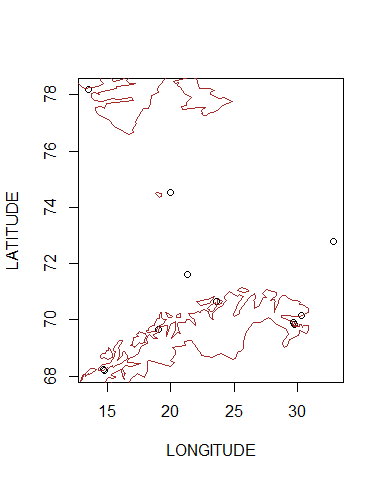
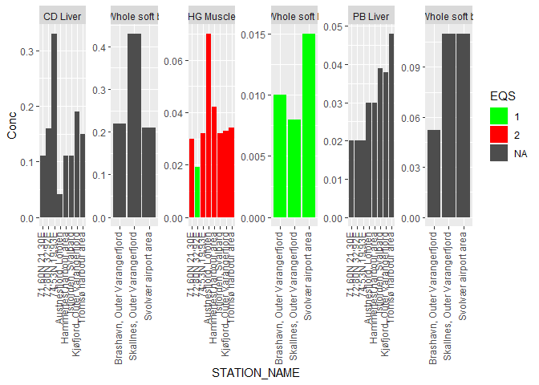
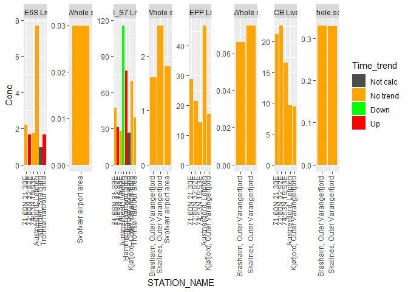
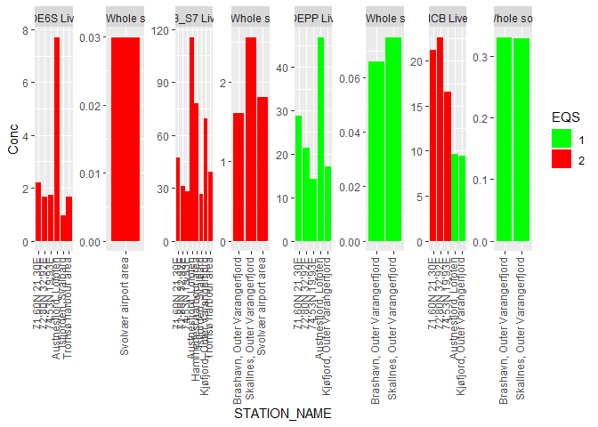

Combining medians from NIFES data (script 11), trends from NIFES data (script 12), and medians and trends from NIVA (script 13).
Also adds limit values.
  
The resulting summary data (one line per time series, i.e. station/substance) are saved as csv and excel files. These are also copied to `K:\Avdeling\Mar\NOG\JMGdata\Kart\Indikatorer\2019`  

## Packages + functions  

```r
library(dplyr)
```

```
## 
## Attaching package: 'dplyr'
```

```
## The following objects are masked from 'package:stats':
## 
##     filter, lag
```

```
## The following objects are masked from 'package:base':
## 
##     intersect, setdiff, setequal, union
```

```r
library(tidyr)
library(readxl)
library(ggplot2)


# File name for export
fn <- "Data_export/GaduMor_2020_withNIFES_ver06"
fn_csv <- paste0(fn, ".csv")
fn_xlsx <- paste0(fn, ".xlsx")
overwrite <- FALSE
#overwrite <- TRUE
```

## Data
Indicators from NIVA serves as the starting point for combining the data  

```r
# NIVA medians
data_xl_sel <- readRDS("Data/13_data_xl_sel (2020).rds")

# NIVA indicators
df_indicator <- readRDS("Data/13_df_indicator_NIVA_only (2020).rds")

# NIFES medians
df_median <- readRDS("Data/11_df_median (2020).rds") %>%
  as.data.frame()

# NIFES regression
nifes_regression <- readRDS("Data/12_nifes_regression (2020).rds")

# Food and EQS limits
df_limits <- read_excel("Input_data/Grenseverdier_fra_Sylvia.xlsx")

# Parameters
sel_param <- c("CD", "HG", "PB", "HCB", "DDEPP", "CB_S7", "BDE6S")
```


## Make 'df_nifes_finalyear'   

```r
df_median <- df_median %>%
  mutate(TISSUE_NAME =
           case_when(Organ %in% "Muskel" ~ "Muscle",
                     Organ %in% "Lever" ~ "Liver"),
         STATION_NAME = Posisjon,
         NIVA_CODE = 
           case_when(TISSUE_NAME %in% "Muscle" ~ "MU",
                     TISSUE_NAME %in% "Liver" ~ "LI")
  )


# Get last year's median
df_nifes_finalyear <- df_median %>% 
  filter(Parameter %in% sel_param & !is.na(Conc)) %>%
  group_by(STATION_NAME, Parameter, TISSUE_NAME, NIVA_CODE)  %>%
  mutate(Maxyear = max(Year)) %>%
  filter(Year == Maxyear) %>%
  select(-LONGITUDE, -LATITUDE) %>%
  as.data.frame()

df_nifes_pos <- df_median %>% 
  filter(Parameter %in% sel_param & !is.na(Conc)) %>%
  group_by(STATION_NAME)  %>%
  summarize(
    LONGITUDE = median(LONGITUDE, na.rm = TRUE),
    LATITUDE = median(LATITUDE, na.rm = TRUE)
  )

df_nifes_finalyear <- 
  df_nifes_finalyear %>% left_join(df_nifes_pos)
```

```
## Joining, by = "STATION_NAME"
```

```r
xtabs(~Parameter + TISSUE_NAME, df_nifes_finalyear)  
```

```
##          TISSUE_NAME
## Parameter Liver Muscle
##     BDE6S     3      0
##     CB_S7     3      0
##     CD        3      0
##     DDEPP     3      0
##     HCB       3      0
##     HG        0      3
##     PB        3      0
```


## Make 'df_indicator_nifes'

```r
df_indicator_nifes <- tibble(
       PROJECT_ID = 9999,
       LATIN_NAME = "Gadus morhua",
       STATION_CODE = "9999", 
       STATION_NAME = df_nifes_finalyear$STATION_NAME,
       LONGITUDE = df_nifes_finalyear$LONGITUDE, 
       LATITUDE = df_nifes_finalyear$LATITUDE,
       PARAM = df_nifes_finalyear$Parameter,
       N = df_nifes_finalyear$N,
       Conc = df_nifes_finalyear$Conc,
       SPECIES_ID = 17,
       TISSUE_NAME = df_nifes_finalyear$TISSUE_NAME,
       NIVA_CODE = df_nifes_finalyear$NIVA_CODE
       )

# Add TISSUE_NAME to nifes_regression (for join below)
nifes_regression <- nifes_regression %>%
  mutate(TISSUE_NAME =
           case_when(TISSUE_NAME %in% "Muskel" ~ "Muscle",
                     TISSUE_NAME %in% "Lever" ~ "Liver",
                     TRUE ~ TISSUE_NAME),
         STATION_NAME = Posisjon
  )

# xtabs(~STATION_NAME, nifes_regression)
nrow(df_indicator_nifes)
```

```
## [1] 21
```

```r
df_indicator_nifes <- left_join(
  df_indicator_nifes, 
  nifes_regression[,c("PARAM", "TISSUE_NAME", "STATION_NAME", "trend")],
  by = c("STATION_NAME", "PARAM", "TISSUE_NAME"))
nrow(df_indicator_nifes)
```

```
## [1] 21
```

```r
# Check
# df_indicator_nifes %>% select(STATION_NAME, LATITUDE, Conc, NIVA_CODE, trend) %>% View()
# df_indicator %>% select(STATION_NAME, LATITUDE, Conc, NIVA_CODE, trend) %>% View()
```

## Combine NIVA and NIFES data

```r
df_indicator2 <- bind_rows(df_indicator, df_indicator_nifes)
df_indicator2 %>% head(2)
```

<div data-pagedtable="false">
  <script data-pagedtable-source type="application/json">
{"columns":[{"label":["PROJECT_ID"],"name":[1],"type":["dbl"],"align":["right"]},{"label":["LATIN_NAME"],"name":[2],"type":["chr"],"align":["left"]},{"label":["STATION_CODE"],"name":[3],"type":["chr"],"align":["left"]},{"label":["SPECIES_ID"],"name":[4],"type":["dbl"],"align":["right"]},{"label":["TISSUE_NAME"],"name":[5],"type":["chr"],"align":["left"]},{"label":["PARAM"],"name":[6],"type":["chr"],"align":["left"]},{"label":["Conc"],"name":[7],"type":["dbl"],"align":["right"]},{"label":["N"],"name":[8],"type":["int"],"align":["right"]},{"label":["LATITUDE"],"name":[9],"type":["dbl"],"align":["right"]},{"label":["LONGITUDE"],"name":[10],"type":["dbl"],"align":["right"]},{"label":["STATION_NAME"],"name":[11],"type":["chr"],"align":["left"]},{"label":["NIVA_CODE"],"name":[12],"type":["chr"],"align":["left"]},{"label":["trend"],"name":[13],"type":["dbl"],"align":["right"]}],"data":[{"1":"3699","2":"Gadus morhua","3":"19B","4":"17","5":"Liver","6":"BDE6S","7":"0.9770","8":"NA","9":"78.170","10":"13.460","11":"Isfjorden, Svalbard","12":"LI","13":"0"},{"1":"3699","2":"Gadus morhua","3":"43B2","4":"17","5":"Liver","6":"BDE6S","7":"1.6714","8":"NA","9":"69.653","10":"18.974","11":"Tromsø harbour area","12":"LI","13":"3"}],"options":{"columns":{"min":{},"max":[10]},"rows":{"min":[10],"max":[10]},"pages":{}}}
  </script>
</div>

```r
nrow(df_indicator2)  # 45
```

```
## [1] 65
```

```r
# Check liver
# xtabs(~STATION_NAME + PARAM, df_indicator2 %>% filter(TISSUE_NAME == "Lever"))  # 94
```

## Map data

```r
# Check that all stations have positions
sum(is.na(df_indicator2$LATITUDE))
```

```
## [1] 0
```

```r
df_indicator2 %>%
  count(STATION_NAME, LATITUDE,  LONGITUDE) %>%
  arrange(LATITUDE)
```

<div data-pagedtable="false">
  <script data-pagedtable-source type="application/json">
{"columns":[{"label":["STATION_NAME"],"name":[1],"type":["chr"],"align":["left"]},{"label":["LATITUDE"],"name":[2],"type":["dbl"],"align":["right"]},{"label":["LONGITUDE"],"name":[3],"type":["dbl"],"align":["right"]},{"label":["n"],"name":[4],"type":["int"],"align":["right"]}],"data":[{"1":"Austnesfjord, Lofoten","2":"68.18577","3":"14.70814","4":"7"},{"1":"Svolvær airport area","2":"68.24917","3":"14.66270","4":"5"},{"1":"Tromsø harbour area","2":"69.65300","3":"18.97400","4":"5"},{"1":"Kjøfjord, Outer Varangerfjord","2":"69.81623","3":"29.76020","4":"6"},{"1":"Brashavn, Outer Varangerfjord","2":"69.89930","3":"29.74100","4":"6"},{"1":"Skallnes, Outer Varangerfjord","2":"70.13728","3":"30.34174","4":"6"},{"1":"Hammerfest harbour area","2":"70.65000","3":"23.63333","4":"4"},{"1":"71,60N 21,30E","2":"71.60000","3":"21.30000","4":"7"},{"1":"72,80N 32,92E","2":"72.80000","3":"32.92000","4":"7"},{"1":"74,53N 19,93E","2":"74.53000","3":"19.93000","4":"7"},{"1":"Isfjorden, Svalbard","2":"78.17000","3":"13.46000","4":"5"}],"options":{"columns":{"min":{},"max":[10]},"rows":{"min":[10],"max":[10]},"pages":{}}}
  </script>
</div>

```r
plot(LATITUDE ~ LONGITUDE, df_indicator2)
maps::map(regions = "Norway", add = TRUE, col = "brown")
```

<!-- -->

## Proref, EQS and mattrygghet

```r
# Get PROREF (Q95) and EQS
df_q95 <- data_xl_sel[data_xl_sel$Basis %in% "WW", c("PARAM", "LATIN_NAME", "TISSUE_NAME", "Q95", "EQS")] %>%
  group_by(PARAM, LATIN_NAME, TISSUE_NAME) %>%
  summarise(Q95 = first(Q95), EQS_threshold = first(EQS))

# Check
# df_q95 %>% filter(PARAM == "HG")

# add PROREF and EQS thresholds
nrow(df_indicator2) # 94
```

```
## [1] 65
```

```r
df_indicator2 <- left_join(df_indicator2, 
                           df_q95,
                           by = c("LATIN_NAME", "TISSUE_NAME", "PARAM"))
nrow(df_indicator2) # 94
```

```
## [1] 65
```

```r
# change EQS threshold for Hg (by mail from Norman; from 1.00 to 0.67)
sel <- df_indicator2$PARAM %in% "CB_S7"; sum(sel) 
```

```
## [1] 11
```

```r
df_indicator2$EQS_threshold[sel] <- 0.67

# Classes changed - original classes were: c(-999999,1,2,5,10,20,999999)
df_indicator2$KLASSE <- with(df_indicator2, 
                             cut(Conc/Q95, breaks = c(-999999,1,2,10,999999), 
                                 right = FALSE, labels = FALSE)
                             )

xtabs(~KLASSE + PARAM, df_indicator2)
```

```
##       PARAM
## KLASSE BDE6S CB_S7 CD DDEPP HCB HG PB
##      1     7     8  4     7   2  9 11
##      2     0     2  5     0   3  2  0
##      3     0     1  2     0   2  0  0
```

```r
#       PARAM
# KLASSE BDE6S CB_S7 CD DDEPP HCB HG PB
#      1     7     7  8     1   1  3  8
#      2     0     1  0     0   0  1  0
#      3     0     0  0     0   0  4  0
     

# EQS classe
df_indicator2$EQS <- with(df_indicator2, 
                          cut(Conc/EQS_threshold, breaks = c(-999999,1,999999), 
                              right = FALSE, labels = FALSE)
                          )

xtabs(~addNA(EQS) + PARAM, df_indicator2)
```

```
##           PARAM
## addNA(EQS) BDE6S CB_S7 CD DDEPP HCB HG PB
##       1        0     0  0     7   4  4  0
##       2        7    11  0     0   3  7  0
##       <NA>     0     0 11     0   0  0 11
```

```r
#           PARAM
# addNA(EQS) BDE6S CB_S7 CD DDEPP HCB HG PB
#       1        0     0  0     1   1  0  0
#       2        7     8  0     0   0  8  0
#       <NA>     0     0 11     0   0  3 11
```

## Add SPECIES_ID

```r
species_code <- 17
df_indicator2$SPECIES_ID <- species_code
```

## Add food limit  
1 = below limit, 2 = above limit

```r
nrow(df_indicator2)
```

```
## [1] 65
```

```r
df_indicator2 <- left_join(
  df_indicator2, 
  subset(df_limits, select = c(PARAM, LATIN_NAME, NIVA_CODE, Mattrygghet)), 
  by = c("PARAM", "LATIN_NAME", "NIVA_CODE"))
nrow(df_indicator2)
```

```
## [1] 65
```

```r
# 96

df_indicator2$Mattrygghet <- cut(with(df_indicator2, Conc/Mattrygghet),
                                 breaks = c(-999999,1,999999), 
                                 right = FALSE, labels = FALSE)

xtabs(~addNA(Mattrygghet) + PARAM + TISSUE_NAME, df_indicator2)
```

```
## , , TISSUE_NAME = Liver
## 
##                   PARAM
## addNA(Mattrygghet) BDE6S CB_S7 CD DDEPP HCB HG PB
##               1        0     8  0     0   0  0  0
##               <NA>     6     0  8     5   5  0  8
## 
## , , TISSUE_NAME = Muscle
## 
##                   PARAM
## addNA(Mattrygghet) BDE6S CB_S7 CD DDEPP HCB HG PB
##               1        0     0  0     0   0  8  0
##               <NA>     0     0  0     0   0  0  0
## 
## , , TISSUE_NAME = Whole soft body
## 
##                   PARAM
## addNA(Mattrygghet) BDE6S CB_S7 CD DDEPP HCB HG PB
##               1        0     3  3     0   0  3  3
##               <NA>     1     0  0     2   2  0  0
```

```r
# tail(df_indicator2)
```

## Save and export  
* On 'data': save with all variables   
* On 'Data_export': pick selected variables  

```r
# Order logically
df_indicator2 <- df_indicator2 %>%
  arrange(PARAM,LONGITUDE,LATITUDE)

# Save with all variables
saveRDS(df_indicator2, file = "Data/14_df_indicator2_cod_ver03 (2020.rds")

# Save with selected variables
vars <- c("PROJECT_ID", "STATION_CODE", "STATION_NAME", 
  "LONGITUDE", "LATITUDE", "PARAM", "N", "KLASSE", 
  "SPECIES_ID", "trend", "NIVA_CODE", "EQS", "Mattrygghet")

# DOnt include HG in liver
sel <- with(df_indicator2, !(PARAM == "HG" & TISSUE_NAME == "Lever"))
sum(sel)
```

```
## [1] 65
```

```r
mean(sel)
```

```
## [1] 1
```

```r
# setwd("H:/Documents/seksjon 212/Indikator 2018/Analyse")


write_safe <- function(data, filename, save_function, overwrite = FALSE, ...){
  # Csv
  if (overwrite | !file.exists(filename)){
    save_function(data, file = filename, ...)
    cat("Data written to file", filename, "\n")
  } else {
    cat("File", filename, "exists, data not saved.\nSet 'overwrite = TRUE' to overwrite file anyway.\n")
  }
}

# Csv
write_safe(df_indicator2[sel,vars], filename = fn_csv, save_function = write.csv,
           overwrite = overwrite, row.names = FALSE, na = "")
```

```
## File Data_export/GaduMor_2020_withNIFES_ver06.csv exists, data not saved.
## Set 'overwrite = TRUE' to overwrite file anyway.
```

```r
# Excel
write_safe(df_indicator2[sel,vars], filename = fn_xlsx, save_function = openxlsx::write.xlsx,
           overwrite = overwrite)
```

```
## File Data_export/GaduMor_2020_withNIFES_ver06.xlsx exists, data not saved.
## Set 'overwrite = TRUE' to overwrite file anyway.
```

```r
# df_indicator2 <- read.csv2(file = "Data_export/GaduMor_2018_withNIFES_ver1.csv")
```

## Checks
### Plots, metals
trend: 0 = no trend calculated, 1 = zero time trend, 2 = up, 3 = down  

```r
df <- df_indicator2 %>%
  filter(!(PARAM == "HG" & TISSUE_NAME == "Lever")) %>%
  mutate(Time_trend =
           case_when(trend %in% 0 ~ "Not calc.",
                     trend %in% 1 ~ "No trend",
                     trend %in% 2 ~ "Down",
                     trend %in% 3 ~ "Up")
         ) %>%
  mutate(Time_trend = factor(Time_trend, levels = c("Not calc.", "No trend", "Down", "Up")),
         Mattrygghet = factor(Mattrygghet, levels = 1:2),
         EQS = factor(EQS, levels = 1:2))

# Fill = trend
gg1 <- df %>%
  filter(PARAM %in% c("HG", "PB", "CD")) %>%
  ggplot(aes(STATION_NAME, Conc, fill = Time_trend)) + 
  geom_col() + 
  scale_fill_manual(values = c("grey30", "orange", "green", "red"), drop = FALSE) +
  facet_wrap(~paste(PARAM,TISSUE_NAME), scales = "free", nrow = 1) +
  theme(axis.text.x = element_text(angle = 90, hjust = 1, vjust = 0.2))

# Fill = Mattrygghet
gg2 <- df %>%
  filter(PARAM %in% c("HG", "PB", "CD")) %>%
  ggplot(aes(STATION_NAME, Conc, fill = Mattrygghet)) + 
  geom_col() + 
  scale_fill_manual(values = c("green", "red"), na.value = "grey30", drop = FALSE) +
  facet_wrap(~paste(PARAM,TISSUE_NAME), scales = "free", nrow = 1) +
  theme(axis.text.x = element_text(angle = 90, hjust = 1, vjust = 0.2))

# Fill = EQS
gg3 <- df %>%
  filter(PARAM %in% c("HG", "PB", "CD")) %>%
  ggplot(aes(STATION_NAME, Conc, fill = EQS)) + 
  geom_col() + 
  scale_fill_manual(values = c("green", "red"), na.value = "grey30", drop = FALSE) +
  facet_wrap(~paste(PARAM,TISSUE_NAME), scales = "free", nrow = 1) +
  theme(axis.text.x = element_text(angle = 90, hjust = 1, vjust = 0.2))

# ggsave()

gg1
```

<!-- -->

```r
gg2
```

<!-- -->

```r
gg3
```

<!-- -->

### Plots, non-metals

```r
gg4 <- df %>%
  filter(!PARAM %in% c("HG", "PB", "CD")) %>%
  ggplot(aes(STATION_NAME, Conc, fill = Time_trend)) + 
  geom_bar(stat = "identity") + 
  scale_fill_manual(values = c("grey30", "orange", "green", "red"), drop = FALSE) +
  facet_wrap(~paste(PARAM,TISSUE_NAME), scales = "free", nrow = 1) +
  theme(axis.text.x = element_text(angle = 90, hjust = 1, vjust = 0.2))


# Fill = Mattrygghet
gg5 <- df %>%
  filter(!PARAM %in% c("HG", "PB", "CD")) %>%
  ggplot(aes(STATION_NAME, Conc, fill = Mattrygghet)) + 
  geom_col() + 
  scale_fill_manual(values = c("green", "red"), na.value = "grey30", drop = FALSE) +
  facet_wrap(~paste(PARAM,TISSUE_NAME), scales = "free", nrow = 1) +
  theme(axis.text.x = element_text(angle = 90, hjust = 1, vjust = 0.2))

# Fill = EQS
gg6 <- df %>%
  filter(!PARAM %in% c("HG", "PB", "CD")) %>%
  ggplot(aes(STATION_NAME, Conc, fill = EQS)) + 
  geom_col() + 
  scale_fill_manual(values = c("green", "red"), na.value = "grey30", drop = FALSE) +
  facet_wrap(~paste(PARAM,TISSUE_NAME), scales = "free", nrow = 1) +
  theme(axis.text.x = element_text(angle = 90, hjust = 1, vjust = 0.2))

gg4
```

<!-- -->

```r
gg5
```

<!-- -->

```r
gg6
```

<!-- -->
