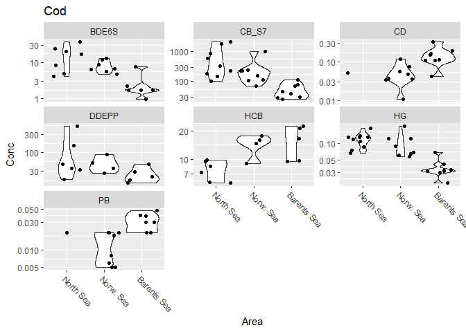

## Packages  


```r
library(tidyverse)
```

```
## -- Attaching packages --------------------------------------- tidyverse 1.3.1 --
```

```
## v ggplot2 3.3.5     v purrr   0.3.4
## v tibble  3.1.6     v dplyr   1.0.7
## v tidyr   1.1.4     v stringr 1.4.0
## v readr   2.0.2     v forcats 0.5.1
```

```
## Warning: package 'tibble' was built under R version 4.1.2
```

```
## -- Conflicts ------------------------------------------ tidyverse_conflicts() --
## x dplyr::filter() masks stats::filter()
## x dplyr::lag()    masks stats::lag()
```

```r
library(readxl)
library(ggeasy)
```


## Cod - excel files  

* See README  


```r
df1 <- read_excel("K:/Avdeling/Mar/NOG/JMGdata/Kart/Indikatorer/2020/Grunnlagsdata/GaduMor_2020data_ver02.xlsx")
```

```
## New names:
## * `` -> ...1
## * `` -> ...5
## * `` -> ...6
```

```r
df2 <- read_excel("K:/Avdeling/Mar/NOG/JMGdata/Kart/Indikatorer/2021/Norskehavet torsk/GaduMor_2021data_Norw_Sea_ver06.xlsx")
```

```
## New names:
## * `` -> ...14
```

```r
df3 <- read_excel("K:/Avdeling/Mar/NOG/JMGdata/Kart/Indikatorer/2019/Grunnlagsdata/GaduMor_2020_withNIFES_ver06.xlsx")  


# names(df1)
# names(df2)
# names(df3)

dat <- bind_rows(
  df1 %>% mutate(Area = "North Sea", .before = 1),
  df2 %>% mutate(Area = "Norw. Sea", .before = 1),
  df3 %>% mutate(Area = "Barents Sea", .before = 1)
) %>%
  mutate(Area = factor(Area) %>% fct_inorder())
```

```
## New names:
## * ...1 -> ...2
## * ...5 -> ...6
## * ...6 -> ...7
```

```
## New names:
## * ...14 -> ...15
```

### Plot class relative to PROREF  

```r
# table(addNA(dat$STATION_NAME))
# table(addNA(dat$PARAM))

for (param in unique(dat$PARAM)){
  gg <- dat %>%
    filter(PARAM %in% param) %>%
    ggplot(aes(STATION_NAME, KLASSE)) +
    geom_point() +
    facet_wrap(vars(Area), scales = "free_x") +
    easy_rotate_x_labels(angle = -45) +
    labs(title = param)
  print(gg)
}
```

<!-- -->

```
## Warning: Removed 1 rows containing missing values (geom_point).
```

<!-- --><!-- --><!-- --><!-- --><!-- --><!-- -->

## Cod and blue mussel - saved data  

```r
# North Sea - cod + blue mussel
df_indicator_1 <- readRDS("Data/14_df_indicator2_cod_ver03 (2021.rds") %>%
  mutate(SPECIES_ID = as.character(SPECIES_ID))

# Norwegian Sea
df_indicator_2a <- readRDS("Data/14_df_indicator4_cod_ver01 (2021_NorwSea.rds") %>%   # cod
  mutate(SPECIES_ID = as.character(SPECIES_ID))
df_indicator_2b <- readRDS("Data/05_df_indicator_bluemussel_2021_ver1.RData") %>%     # blue mussel
  mutate(SPECIES_ID = as.character(SPECIES_ID))

# Barents Sea - cod + blue mussel
df_indicator_3 <- readRDS("Data/14_df_indicator2_cod_ver03 (2020.rds") %>%
  mutate(SPECIES_ID = as.character(SPECIES_ID))

dat2 <- bind_rows(
  df_indicator_1 %>% mutate(Area = "North Sea", .before = 1),
  df_indicator_2a %>% mutate(Area = "Norw. Sea", .before = 1),
  df_indicator_2b %>% mutate(Area = "Norw. Sea", .before = 1),
  df_indicator_3 %>% mutate(Area = "Barents Sea", .before = 1)
) %>%
  mutate(Area = factor(Area) %>% fct_inorder())


xtabs(~LATIN_NAME + Area, dat2)
```

```
##                   Area
## LATIN_NAME         North Sea Norw. Sea Barents Sea
##   Gadus morhua            40        47          48
##   Mytilus edulis          60        35          17
##   Nucella lapillus         0         2           0
```

### Cod, concentrations by station    

```r
# table(addNA(dat2$STATION_NAME))
# table(addNA(dat2$PARAM))

for (param in unique(dat$PARAM)){
  gg <- dat2 %>%
    filter(PARAM %in% param & LATIN_NAME == "Gadus morhua") %>%
    mutate(Source = ifelse(STATION_CODE == "9999", "HI", "NIVA")) %>%
    ggplot(aes(STATION_NAME, Conc, colour = Source)) +
    geom_point() +
    scale_y_log10() +
    facet_wrap(vars(Area), scales = "free_x") +
    easy_rotate_x_labels(angle = -45) +
    labs(title = param)
  
  print(gg)
  
}
```

<!-- --><!-- --><!-- --><!-- --><!-- --><!-- --><!-- -->


### Cod, violin plot  

```r
# table(addNA(dat$STATION_NAME))
# table(addNA(dat$PARAM))

gg <- dat2 %>%
  filter(LATIN_NAME == "Gadus morhua") %>%
  ggplot(aes(Area, Conc)) +
  geom_violin() +
  geom_jitter() +
  scale_y_log10() +
  facet_wrap(vars(PARAM), scales = "free_y") +
  easy_rotate_x_labels(angle = -45) +
  labs(title = "Cod")

print(gg)
```

```
## Warning: Groups with fewer than two data points have been dropped.

## Warning: Groups with fewer than two data points have been dropped.
```

<!-- -->

## Cod and blue mussel - saved data  

```r
# North Sea - cod + blue mussel
df_indicator_1 <- readRDS("Data/14_df_indicator2_cod_ver03 (2021.rds") %>%
  mutate(SPECIES_ID = as.character(SPECIES_ID))

# Norwegian Sea
df_indicator_2a <- readRDS("Data/14_df_indicator4_cod_ver01 (2021_NorwSea.rds") %>%   # cod
  mutate(SPECIES_ID = as.character(SPECIES_ID))
df_indicator_2b <- readRDS("Data/05_df_indicator_bluemussel_2021_ver1.RData") %>%     # blue mussel
  mutate(SPECIES_ID = as.character(SPECIES_ID))

# Barents Sea - cod + blue mussel
df_indicator_3 <- readRDS("Data/14_df_indicator2_cod_ver03 (2020.rds") %>%
  mutate(SPECIES_ID = as.character(SPECIES_ID))

dat2 <- bind_rows(
  df_indicator_1 %>% mutate(Area = "North Sea", .before = 1),
  df_indicator_2a %>% mutate(Area = "Norw. Sea", .before = 1),
  df_indicator_2b %>% mutate(Area = "Norw. Sea", .before = 1),
  df_indicator_3 %>% mutate(Area = "Barents Sea", .before = 1)
) %>%
  mutate(Area = factor(Area) %>% fct_inorder())


xtabs(~LATIN_NAME + Area, dat2)
```

```
##                   Area
## LATIN_NAME         North Sea Norw. Sea Barents Sea
##   Gadus morhua            40        47          48
##   Mytilus edulis          60        35          17
##   Nucella lapillus         0         2           0
```

### Blue mussel, concentrations by station    

```r
# table(addNA(dat2$STATION_NAME))
# table(addNA(dat2$PARAM))

for (param in unique(dat$PARAM)){
  gg <- dat2 %>%
    filter(PARAM %in% param & LATIN_NAME == "Mytilus edulis") %>%
    ggplot(aes(STATION_NAME, Conc)) +
    geom_point() +
    scale_y_log10() +
    facet_wrap(vars(Area), scales = "free_x") +
    easy_rotate_x_labels(angle = -45) +
    labs(title = param)
  
  print(gg)
  
}
```

<!-- --><!-- --><!-- --><!-- --><!-- --><!-- --><!-- -->

### Blue mussel, violin plot  

```r
# table(addNA(dat$STATION_NAME))
# table(addNA(dat$PARAM))

gg <- dat2 %>%
  filter(LATIN_NAME == "Mytilus edulis") %>%
  ggplot(aes(Area, Conc)) +
  geom_violin() +
  geom_jitter() +
  scale_y_log10() +
  facet_wrap(vars(PARAM), scales = "free_y") +
  easy_rotate_x_labels(angle = -45) +
  labs(title = "Cod")

print(gg)
```

```
## Warning: Groups with fewer than two data points have been dropped.
```

<!-- -->

